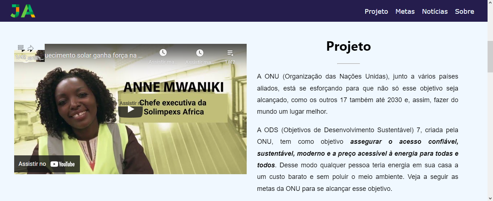
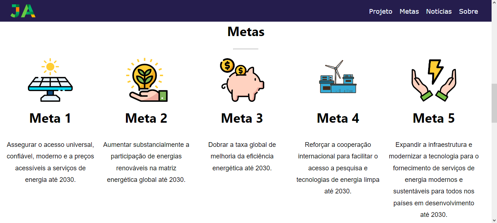
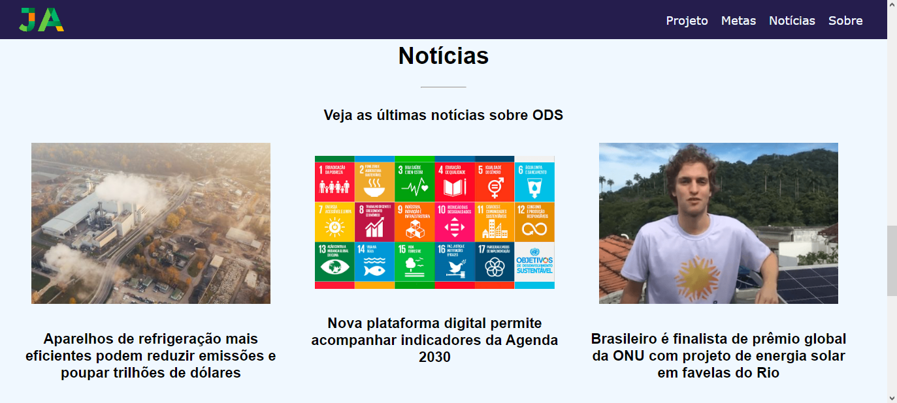

<head>
    <link href="MarkDown/estiloMarkDown.css" rel="stylesheet">
</head>

<h1 class="titulo">Projeto Meu Primeiro Site</h1>

 Repositório do desenvolvimento do Projeto Meu Primeiro Site, realizado pela Junior Achievement em parceria com a Microsoft.
 
 Esse projeto foi realizado com o auxílio do professor Luíz Lombardi.

 
</img>
 
 
</img>
 
 
</img>
 
 
</img>
 
 
</img>

<h2 id="Status"> Projeto Meu Primeiro Site 😁 Finalizado ✔</h2>
<h3 id="Link">Link do Site: <a href="Geydson-Santos.github.io">Geydson-Santos.github.io</a><h3>

 

<h2 id="Obrigado">Obrigado! 😉</h2>

<!--

👉 <a href="#Sobre">Sobre</a>

# Sobre
-->
